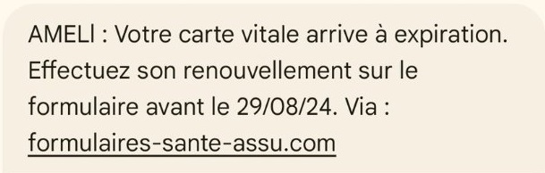

# 📸 Exemples de SMS Frauduleux

Ce document regroupe des exemples réels de SMS frauduleux.  
Chaque capture est accompagnée d’explications pour aider l'utilisateur à reconnaître les arnaques les plus courantes.

---

# 🚚 1. Arnaques — Faux Colis / Faux Frais de Livraison

## Exemple 1

**Ce qui cloche :**
- Lien inconnu ou raccourci (bit.ly, t.ly, tinyurl)
- Demande de paiement pour “libérer” un colis
- Ton urgent : “dernière tentative”, “votre colis retourne à l’expéditeur”
- Aucun transporteur identifié

---

## Exemple 2

**Ce qui cloche :**
- Numéro de suivi invalide ou incohérent
- Absence de signature officielle
- Orthographe approximative

---

# 🎬 2. Arnaques — Netflix / Services d’abonnement

## Exemple 1

**Ce qui cloche :**
- “Votre compte est suspendu” = classique arnaque
- Lien vers un site qui n’est pas netflix.com
- Menace immédiate pour pousser au clic

---

## Exemple 2

**Ce qui cloche :**
- Demande de mettre à jour un moyen de paiement
- Message impersonnel et générique
- Numéro d’envoi non-officiel

---

# 🏦 3. Arnaques — Banque / Fraude à la Carte Bancaire

## Exemple 1

**Ce qui cloche :**
- Redirection vers un faux espace client
- Menace de blocage express
- Aucune mention personnalisée du compte ou de la banque

---

## Exemple 2

**Ce qui cloche :**
- Numéro d’appel surtaxé ou inconnu
- Orthographe / syntaxe suspecte
- Lien qui n’a rien à voir avec la banque réelle

---

# ❤️ 4. Arnaques Sentimentales — “Bonjour maman…” / “J’ai cassé mon téléphone”

## Exemple 1

**Ce qui cloche :**
- Message très vague sans prénom
- Nouvelle identité “temporaire” pour gagner la confiance
- Suit un script connu : “mon téléphone est cassé… j’ai besoin d’aide”

---

## Exemple 2

**Ce qui cloche :**
- Réclamation rapide d’un virement
- Prétendue urgence
- Aucune preuve de l’identité de l’expéditeur

---

# 🏥 5. Arnaques — Ameli / Assurance Maladie

## Exemple 1

**Ce qui cloche :**
- Ameli n’envoie jamais de remboursement par SMS
- Lien extérieur non sécurisé
- Référence floue à un “nouveau document”

---

## Exemple 2

**Ce qui cloche :**
- Annonce d’un remboursement automatique
- Demande d’informations personnelles ou bancaires
- Absence d’identification officielle

---

# 🎓 6. Arnaques — Compte de Formation (CPF)

## Exemple 1

**Ce qui cloche :**
- Sollicitation non désirée : très répandue
- Tentative d’obtenir vos données CPF
- Promesse de financement gratuit ou urgent

